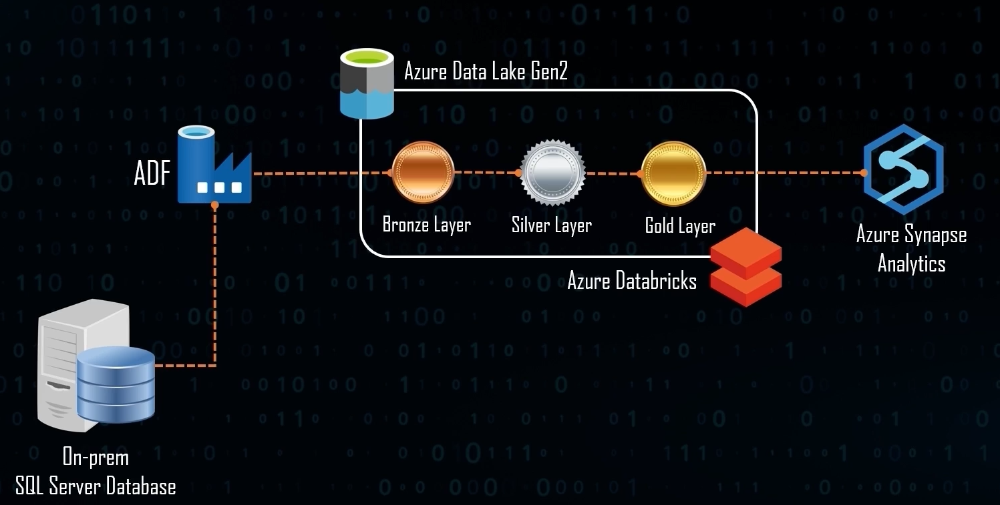

# Azure-Data-Engineering-OnPrem-Project
AdventureWorks Data Engineering pipeline using Azure and On Prem SQL SERVER Database
## Introduction
This project aims to establish a robust data engineering pipeline utilizing Azure cloud services and an on-premises SQL Server database. By leveraging Azure Data Factory, Data Lake Gen2, Data Bricks, and Synapse Analytics, we will effectively extract, transform, and load (ETL) data from the AdventureWorks database, creating a scalable and efficient data warehousing solution

## Architechture

## Technology Used
1. Programming Language - Python
2. Scripting Language - SQL
3. Azure Cloud Platform
   - Azure Data Factory
   - Azure Data Lake Gen 2
   - Azure Data Bricks
   - Azure Synaps

## Database Files Used 
**Visit the official Microsoft GitHub repository for AdventureWorks samples** at https://github.com/Microsoft/sql-server-samples/releases/tag/adventureworks.
